# Elidia CLI — Architecture Flowcharts

## 1. System Overview (High Level)

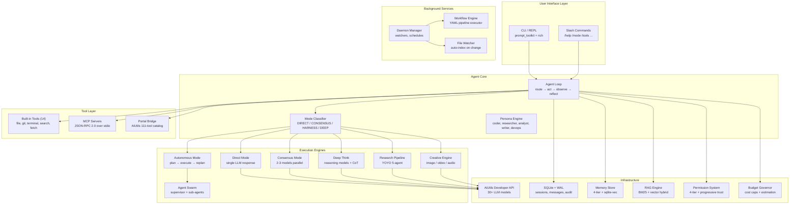
```mermaid
graph TB
    subgraph USER["User Interface Layer"]
        CLI["CLI / REPL<br/>prompt_toolkit + rich"]
        SLASH["Slash Commands<br/>/help /mode /tools ..."]
    end

    subgraph AGENT["Agent Core"]
        LOOP["Agent Loop<br/>route → act → observe → reflect"]
        MODES["Mode Classifier<br/>DIRECT / CONSENSUS / HARNESS / DEEP"]
        PERSONAS["Persona Engine<br/>coder, researcher, analyst, writer, devops"]
    end

    subgraph EXEC["Execution Engines"]
        DIRECT["Direct Mode<br/>single LLM response"]
        CONSENSUS["Consensus Mode<br/>2-3 models parallel"]
        HARNESS["Autonomous Mode<br/>plan → execute → replan"]
        DEEP["Deep Think<br/>reasoning models + CoT"]
        RESEARCH["Research Pipeline<br/>YOYO 5-agent"]
        CREATIVE["Creative Engine<br/>image / video / audio"]
        SWARM["Agent Swarm<br/>supervisor + sub-agents"]
    end

    subgraph TOOLS["Tool Layer"]
        BUILTIN["Built-in Tools (14)<br/>file, git, terminal, search, fetch"]
        MCP["MCP Servers<br/>JSON-RPC 2.0 over stdio"]
        PORTAL["Portal Bridge<br/>AiUtils 111-tool catalog"]
    end

    subgraph INFRA["Infrastructure"]
        API["AiUtils Developer API<br/>30+ LLM models"]
        DB["SQLite + WAL<br/>sessions, messages, audit"]
        MEM["Memory Store<br/>4-tier + sqlite-vec"]
        RAG["RAG Engine<br/>BM25 + vector hybrid"]
        PERMS["Permission System<br/>4-tier + progressive trust"]
        BUDGET["Budget Governor<br/>cost caps + estimation"]
    end

    subgraph BG["Background Services"]
        DAEMON["Daemon Manager<br/>watchers, schedules"]
        WORKFLOW["Workflow Engine<br/>YAML pipeline executor"]
        WATCHER["File Watcher<br/>auto-index on change"]
    end

    CLI --> LOOP
    SLASH --> LOOP
    LOOP --> MODES
    MODES --> DIRECT
    MODES --> CONSENSUS
    MODES --> HARNESS
    MODES --> DEEP
    MODES --> RESEARCH
    MODES --> CREATIVE
    HARNESS --> SWARM
    LOOP --> BUILTIN
    LOOP --> MCP
    LOOP --> PORTAL
    LOOP --> PERMS
    LOOP --> BUDGET
    DIRECT --> API
    CONSENSUS --> API
    DEEP --> API
    RESEARCH --> API
    CREATIVE --> API
    LOOP --> MEM
    LOOP --> RAG
    LOOP --> DB
    DAEMON --> WORKFLOW
    DAEMON --> WATCHER
```

## 2. Agent Loop (Core Execution)

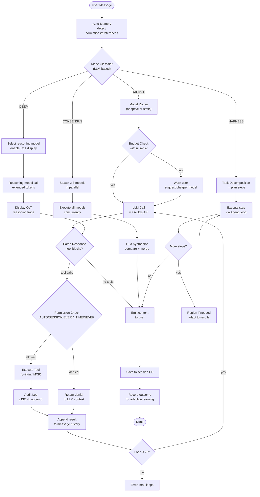
```mermaid
flowchart TD
    START([User Message]) --> AUTO_MEM["Auto-Memory<br/>detect corrections/preferences"]
    AUTO_MEM --> CLASSIFY{"Mode Classifier<br/>(LLM-based)"}

    CLASSIFY -->|DIRECT| ROUTE["Model Router<br/>(adaptive or static)"]
    CLASSIFY -->|CONSENSUS| CON_START["Spawn 2-3 models<br/>in parallel"]
    CLASSIFY -->|HARNESS| PLAN["Task Decomposition<br/>→ plan steps"]
    CLASSIFY -->|DEEP| THINK["Select reasoning model<br/>enable CoT display"]

    ROUTE --> BUDGET_CHECK{"Budget Check<br/>within limits?"}
    BUDGET_CHECK -->|yes| LLM_CALL["LLM Call<br/>via AiUtils API"]
    BUDGET_CHECK -->|no| WARN["Warn user<br/>suggest cheaper model"]
    WARN --> LLM_CALL

    LLM_CALL --> PARSE{"Parse Response<br/>tool blocks?"}
    PARSE -->|no tools| EMIT["Emit content<br/>to user"]
    PARSE -->|tool calls| PERM{"Permission Check<br/>AUTO/SESSION/EVERY_TIME/NEVER"}

    PERM -->|denied| DENY["Return denial<br/>to LLM context"]
    PERM -->|allowed| EXEC_TOOL["Execute Tool<br/>(built-in / MCP)"]
    EXEC_TOOL --> AUDIT["Audit Log<br/>(JSONL append)"]
    AUDIT --> OBSERVE["Append result<br/>to message history"]
    OBSERVE --> LOOP_CHECK{"Loop < 25?"}
    LOOP_CHECK -->|yes| LLM_CALL
    LOOP_CHECK -->|no| MAX_ERR["Error: max loops"]
    DENY --> OBSERVE

    CON_START --> CON_EXEC["Execute all models<br/>concurrently"]
    CON_EXEC --> CON_SYNTH["LLM Synthesize<br/>compare + merge"]
    CON_SYNTH --> EMIT

    PLAN --> STEP_EXEC["Execute step<br/>via Agent Loop"]
    STEP_EXEC --> STEP_CHECK{"More steps?"}
    STEP_CHECK -->|yes| REPLAN["Replan if needed<br/>adapt to results"]
    REPLAN --> STEP_EXEC
    STEP_CHECK -->|no| EMIT

    THINK --> THINK_CALL["Reasoning model call<br/>extended tokens"]
    THINK_CALL --> COT_DISPLAY["Display CoT<br/>reasoning trace"]
    COT_DISPLAY --> PARSE

    EMIT --> SAVE_MSG["Save to session DB"]
    SAVE_MSG --> OUTCOME["Record outcome<br/>for adaptive learning"]
    OUTCOME --> DONE([Done])
```

## 3. Mode Classification Flow

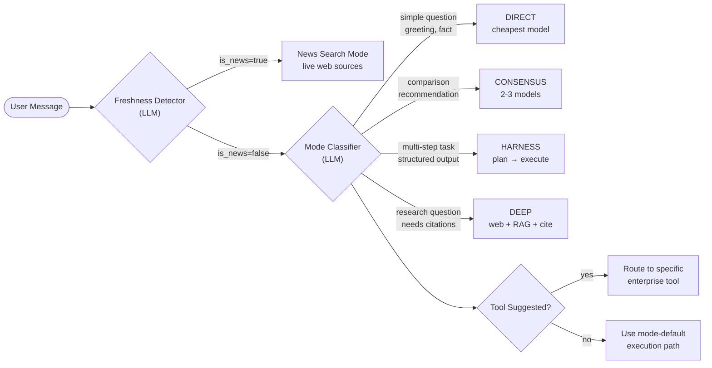
```mermaid
flowchart LR
    MSG([User Message]) --> FRESH{"Freshness Detector<br/>(LLM)"}
    FRESH -->|is_news=true| NEWS["News Search Mode<br/>live web sources"]
    FRESH -->|is_news=false| MC{"Mode Classifier<br/>(LLM)"}

    MC -->|"simple question<br/>greeting, fact"| DIRECT["DIRECT<br/>cheapest model"]
    MC -->|"comparison<br/>recommendation"| CONSENSUS["CONSENSUS<br/>2-3 models"]
    MC -->|"multi-step task<br/>structured output"| HARNESS["HARNESS<br/>plan → execute"]
    MC -->|"research question<br/>needs citations"| DEEP["DEEP<br/>web + RAG + cite"]

    MC --> TOOL_DETECT{"Tool Suggested?"}
    TOOL_DETECT -->|yes| TOOL_ROUTE["Route to specific<br/>enterprise tool"]
    TOOL_DETECT -->|no| DEFAULT_ROUTE["Use mode-default<br/>execution path"]
```

## 4. Memory & RAG System

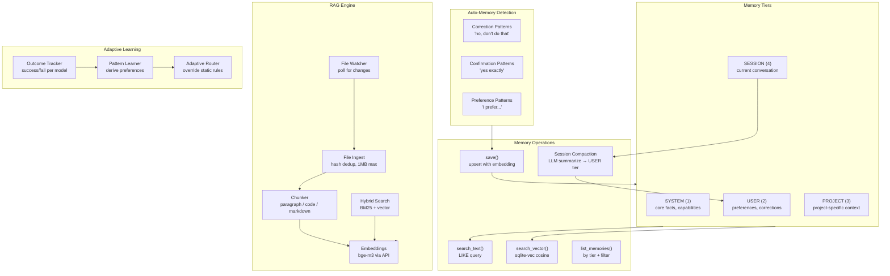
```mermaid
flowchart TB
    subgraph MEM_TIERS["Memory Tiers"]
        SYS["SYSTEM (1)<br/>core facts, capabilities"]
        USR["USER (2)<br/>preferences, corrections"]
        PRJ["PROJECT (3)<br/>project-specific context"]
        SES["SESSION (4)<br/>current conversation"]
    end

    subgraph MEM_OPS["Memory Operations"]
        SAVE["save()<br/>upsert with embedding"]
        SEARCH_T["search_text()<br/>LIKE query"]
        SEARCH_V["search_vector()<br/>sqlite-vec cosine"]
        LIST["list_memories()<br/>by tier + filter"]
        COMPACT["Session Compaction<br/>LLM summarize → USER tier"]
    end

    subgraph AUTO["Auto-Memory Detection"]
        CORR["Correction Patterns<br/>'no, don't do that'"]
        CONF["Confirmation Patterns<br/>'yes exactly'"]
        PREF["Preference Patterns<br/>'I prefer...'"]
    end

    subgraph RAG_SYS["RAG Engine"]
        INGEST["File Ingest<br/>hash dedup, 1MB max"]
        CHUNK["Chunker<br/>paragraph / code / markdown"]
        EMBED["Embeddings<br/>bge-m3 via API"]
        HYBRID["Hybrid Search<br/>BM25 + vector"]
        WATCH["File Watcher<br/>poll for changes"]
    end

    subgraph LEARN["Adaptive Learning"]
        OUTCOMES["Outcome Tracker<br/>success/fail per model"]
        PATTERNS["Pattern Learner<br/>derive preferences"]
        ADAPTIVE["Adaptive Router<br/>override static rules"]
    end

    AUTO --> SAVE
    SAVE --> MEM_TIERS
    MEM_TIERS --> SEARCH_T
    MEM_TIERS --> SEARCH_V
    SES --> COMPACT
    COMPACT --> USR

    WATCH --> INGEST
    INGEST --> CHUNK
    CHUNK --> EMBED
    EMBED --> RAG_SYS
    HYBRID --> EMBED

    OUTCOMES --> PATTERNS
    PATTERNS --> ADAPTIVE
```

## 5. Tool Execution Pipeline

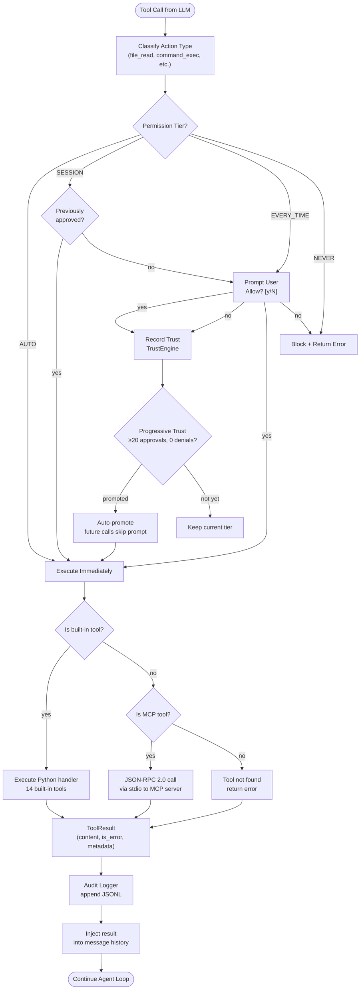
```mermaid
flowchart TD
    TC([Tool Call from LLM]) --> CLASSIFY_ACTION["Classify Action Type<br/>(file_read, command_exec, etc.)"]
    CLASSIFY_ACTION --> TIER{"Permission Tier?"}

    TIER -->|AUTO| EXEC["Execute Immediately"]
    TIER -->|SESSION| S_CHECK{"Previously<br/>approved?"}
    S_CHECK -->|yes| EXEC
    S_CHECK -->|no| PROMPT["Prompt User<br/>Allow? [y/N]"]
    TIER -->|EVERY_TIME| PROMPT
    TIER -->|NEVER| BLOCK["Block + Return Error"]

    PROMPT -->|yes| TRUST_REC["Record Trust<br/>TrustEngine"]
    PROMPT -->|no| TRUST_REC
    TRUST_REC --> TRUST_CHECK{"Progressive Trust<br/>≥20 approvals, 0 denials?"}
    TRUST_CHECK -->|promoted| PROMOTE["Auto-promote<br/>future calls skip prompt"]
    TRUST_CHECK -->|not yet| KEEP["Keep current tier"]
    PROMOTE --> EXEC
    PROMPT -->|yes| EXEC
    PROMPT -->|no| BLOCK

    EXEC --> BUILTIN_CHECK{"Is built-in tool?"}
    BUILTIN_CHECK -->|yes| BUILTIN_EXEC["Execute Python handler<br/>14 built-in tools"]
    BUILTIN_CHECK -->|no| MCP_CHECK{"Is MCP tool?"}
    MCP_CHECK -->|yes| MCP_EXEC["JSON-RPC 2.0 call<br/>via stdio to MCP server"]
    MCP_CHECK -->|no| NOT_FOUND["Tool not found<br/>return error"]

    BUILTIN_EXEC --> RESULT["ToolResult<br/>(content, is_error, metadata)"]
    MCP_EXEC --> RESULT
    NOT_FOUND --> RESULT

    RESULT --> AUDIT_LOG["Audit Logger<br/>append JSONL"]
    AUDIT_LOG --> INJECT["Inject result<br/>into message history"]
    INJECT --> NEXT([Continue Agent Loop])
```

## 6. Thinking Levels

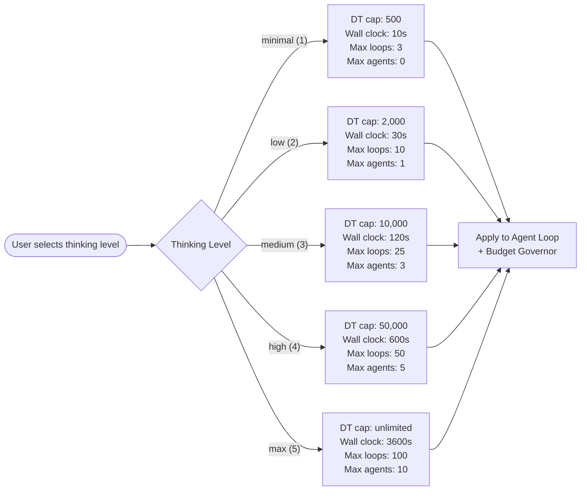
```mermaid
flowchart LR
    INPUT([User selects thinking level]) --> LEVEL{"Thinking Level"}

    LEVEL -->|"minimal (1)"| L1["DT cap: 500<br/>Wall clock: 10s<br/>Max loops: 3<br/>Max agents: 0"]
    LEVEL -->|"low (2)"| L2["DT cap: 2,000<br/>Wall clock: 30s<br/>Max loops: 10<br/>Max agents: 1"]
    LEVEL -->|"medium (3)"| L3["DT cap: 10,000<br/>Wall clock: 120s<br/>Max loops: 25<br/>Max agents: 3"]
    LEVEL -->|"high (4)"| L4["DT cap: 50,000<br/>Wall clock: 600s<br/>Max loops: 50<br/>Max agents: 5"]
    LEVEL -->|"max (5)"| L5["DT cap: unlimited<br/>Wall clock: 3600s<br/>Max loops: 100<br/>Max agents: 10"]

    L1 --> APPLY["Apply to Agent Loop<br/>+ Budget Governor"]
    L2 --> APPLY
    L3 --> APPLY
    L4 --> APPLY
    L5 --> APPLY
```

## 7. Research Pipeline (YOYO)

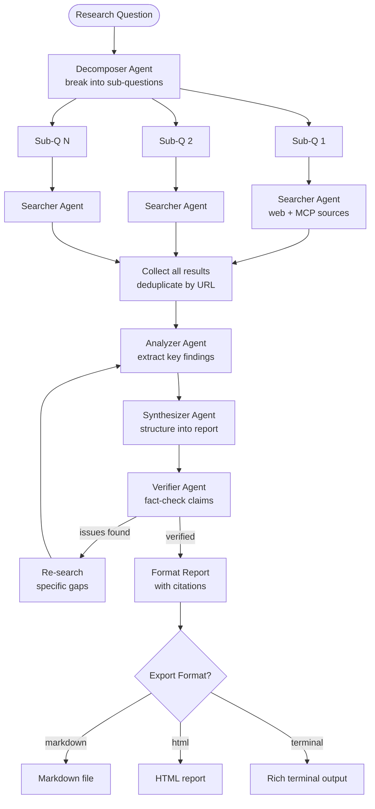
```mermaid
flowchart TD
    Q([Research Question]) --> DECOMPOSE["Decomposer Agent<br/>break into sub-questions"]
    DECOMPOSE --> SQ1["Sub-Q 1"]
    DECOMPOSE --> SQ2["Sub-Q 2"]
    DECOMPOSE --> SQ3["Sub-Q N"]

    SQ1 --> SEARCH1["Searcher Agent<br/>web + MCP sources"]
    SQ2 --> SEARCH2["Searcher Agent"]
    SQ3 --> SEARCH3["Searcher Agent"]

    SEARCH1 --> RESULTS["Collect all results<br/>deduplicate by URL"]
    SEARCH2 --> RESULTS
    SEARCH3 --> RESULTS

    RESULTS --> ANALYZE["Analyzer Agent<br/>extract key findings"]
    ANALYZE --> SYNTHESIZE["Synthesizer Agent<br/>structure into report"]
    SYNTHESIZE --> VERIFY["Verifier Agent<br/>fact-check claims"]

    VERIFY -->|issues found| SEARCH_AGAIN["Re-search<br/>specific gaps"]
    SEARCH_AGAIN --> ANALYZE
    VERIFY -->|verified| FORMAT["Format Report<br/>with citations"]

    FORMAT --> EXPORT{"Export Format?"}
    EXPORT -->|markdown| MD["Markdown file"]
    EXPORT -->|html| HTML["HTML report"]
    EXPORT -->|terminal| TERM["Rich terminal output"]
```

## 8. Creative Pipeline

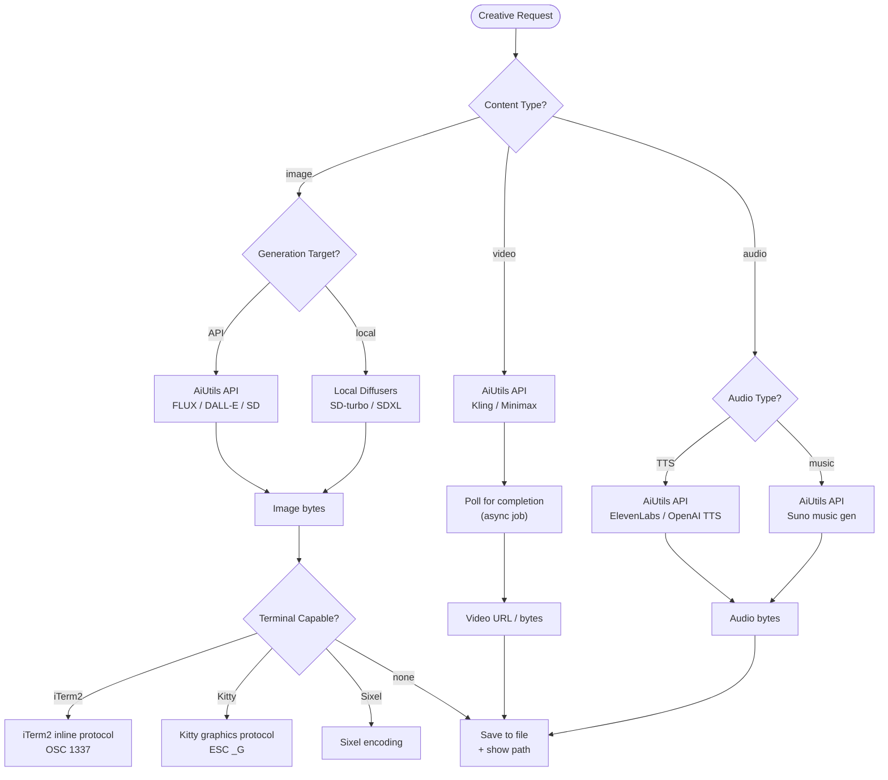
```mermaid
flowchart TD
    REQ([Creative Request]) --> TYPE{"Content Type?"}

    TYPE -->|image| IMG_ROUTE{"Generation Target?"}
    IMG_ROUTE -->|API| IMG_API["AiUtils API<br/>FLUX / DALL-E / SD"]
    IMG_ROUTE -->|local| IMG_LOCAL["Local Diffusers<br/>SD-turbo / SDXL"]
    IMG_API --> IMG_RESULT["Image bytes"]
    IMG_LOCAL --> IMG_RESULT

    TYPE -->|video| VID_API["AiUtils API<br/>Kling / Minimax"]
    VID_API --> VID_POLL["Poll for completion<br/>(async job)"]
    VID_POLL --> VID_RESULT["Video URL / bytes"]

    TYPE -->|audio| AUD_ROUTE{"Audio Type?"}
    AUD_ROUTE -->|TTS| TTS_API["AiUtils API<br/>ElevenLabs / OpenAI TTS"]
    AUD_ROUTE -->|music| MUSIC_API["AiUtils API<br/>Suno music gen"]
    TTS_API --> AUD_RESULT["Audio bytes"]
    MUSIC_API --> AUD_RESULT

    IMG_RESULT --> DISPLAY{"Terminal Capable?"}
    DISPLAY -->|iTerm2| ITERM["iTerm2 inline protocol<br/>OSC 1337"]
    DISPLAY -->|Kitty| KITTY["Kitty graphics protocol<br/>ESC _G"]
    DISPLAY -->|Sixel| SIXEL["Sixel encoding"]
    DISPLAY -->|none| SAVE_FILE["Save to file<br/>+ show path"]

    VID_RESULT --> SAVE_FILE
    AUD_RESULT --> SAVE_FILE
```

## 9. Workflow Engine

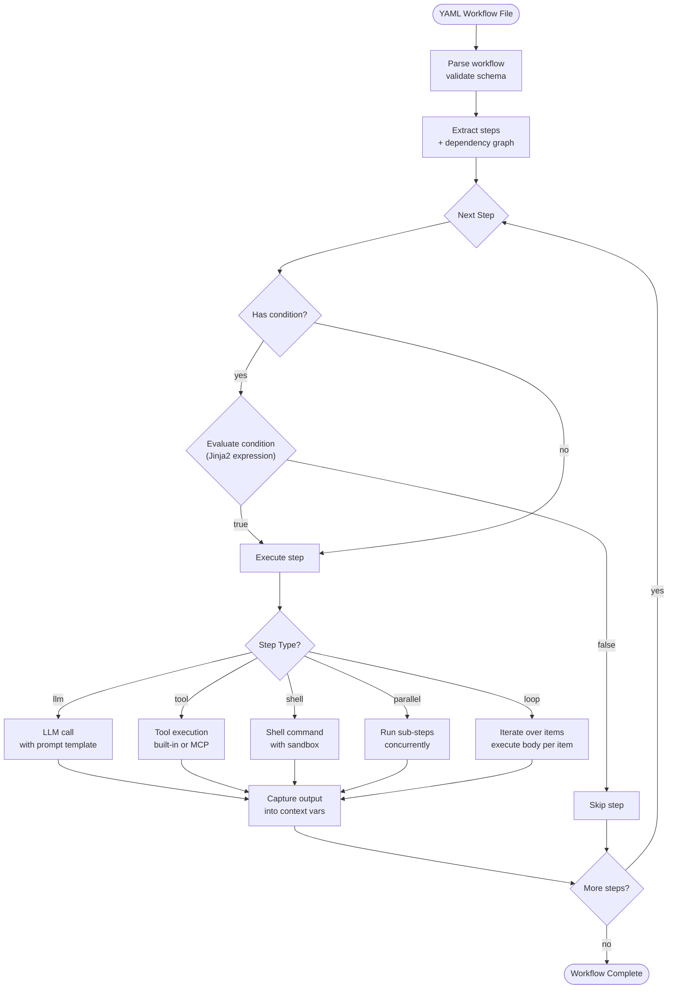
```mermaid
flowchart TD
    YAML([YAML Workflow File]) --> PARSE["Parse workflow<br/>validate schema"]
    PARSE --> STEPS["Extract steps<br/>+ dependency graph"]

    STEPS --> EXEC_STEP{"Next Step"}

    EXEC_STEP --> COND{"Has condition?"}
    COND -->|yes| EVAL_COND{"Evaluate condition<br/>(Jinja2 expression)"}
    EVAL_COND -->|true| RUN_STEP["Execute step"]
    EVAL_COND -->|false| SKIP["Skip step"]
    COND -->|no| RUN_STEP

    RUN_STEP --> STEP_TYPE{"Step Type?"}
    STEP_TYPE -->|llm| LLM_STEP["LLM call<br/>with prompt template"]
    STEP_TYPE -->|tool| TOOL_STEP["Tool execution<br/>built-in or MCP"]
    STEP_TYPE -->|shell| SHELL_STEP["Shell command<br/>with sandbox"]
    STEP_TYPE -->|parallel| PAR_STEP["Run sub-steps<br/>concurrently"]
    STEP_TYPE -->|loop| LOOP_STEP["Iterate over items<br/>execute body per item"]

    LLM_STEP --> CAPTURE["Capture output<br/>into context vars"]
    TOOL_STEP --> CAPTURE
    SHELL_STEP --> CAPTURE
    PAR_STEP --> CAPTURE
    LOOP_STEP --> CAPTURE

    CAPTURE --> MORE{"More steps?"}
    MORE -->|yes| EXEC_STEP
    MORE -->|no| DONE([Workflow Complete])
    SKIP --> MORE
```

## 10. Daemon & Background Services

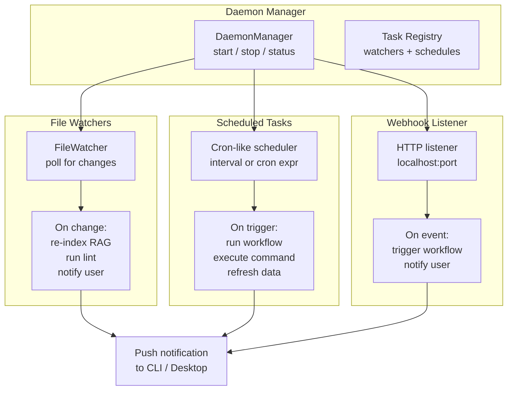
```mermaid
flowchart TD
    subgraph DAEMON["Daemon Manager"]
        DM["DaemonManager<br/>start / stop / status"]
        REG["Task Registry<br/>watchers + schedules"]
    end

    subgraph WATCHERS["File Watchers"]
        FW["FileWatcher<br/>poll for changes"]
        FW_ACTION["On change:<br/>re-index RAG<br/>run lint<br/>notify user"]
    end

    subgraph SCHEDULES["Scheduled Tasks"]
        CRON["Cron-like scheduler<br/>interval or cron expr"]
        CRON_ACTION["On trigger:<br/>run workflow<br/>execute command<br/>refresh data"]
    end

    subgraph WEBHOOKS["Webhook Listener"]
        WH["HTTP listener<br/>localhost:port"]
        WH_ACTION["On event:<br/>trigger workflow<br/>notify user"]
    end

    DM --> FW
    DM --> CRON
    DM --> WH
    FW --> FW_ACTION
    CRON --> CRON_ACTION
    WH --> WH_ACTION

    FW_ACTION --> NOTIFY["Push notification<br/>to CLI / Desktop"]
    CRON_ACTION --> NOTIFY
    WH_ACTION --> NOTIFY
```

## 11. Widget Protocol

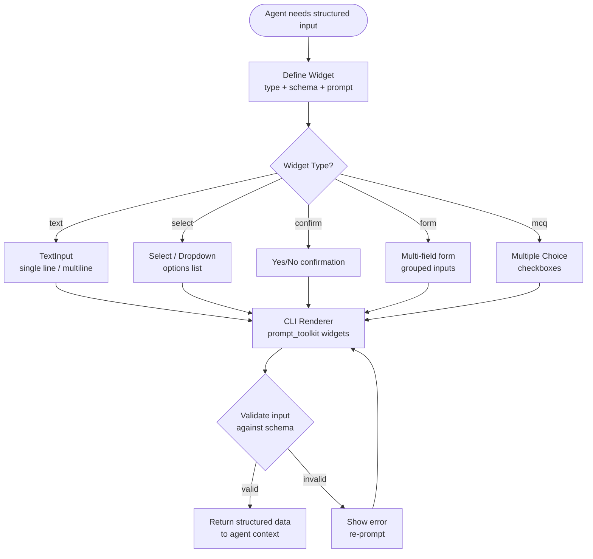
```mermaid
flowchart TD
    NEED([Agent needs structured input]) --> WIDGET_DEF["Define Widget<br/>type + schema + prompt"]

    WIDGET_DEF --> TYPE{"Widget Type?"}
    TYPE -->|text| TEXT_W["TextInput<br/>single line / multiline"]
    TYPE -->|select| SELECT_W["Select / Dropdown<br/>options list"]
    TYPE -->|confirm| CONFIRM_W["Yes/No confirmation"]
    TYPE -->|form| FORM_W["Multi-field form<br/>grouped inputs"]
    TYPE -->|mcq| MCQ_W["Multiple Choice<br/>checkboxes"]

    TEXT_W --> RENDER["CLI Renderer<br/>prompt_toolkit widgets"]
    SELECT_W --> RENDER
    CONFIRM_W --> RENDER
    FORM_W --> RENDER
    MCQ_W --> RENDER

    RENDER --> VALIDATE{"Validate input<br/>against schema"}
    VALIDATE -->|valid| RETURN["Return structured data<br/>to agent context"]
    VALIDATE -->|invalid| RETRY["Show error<br/>re-prompt"]
    RETRY --> RENDER
```

## 12. Budget Governance

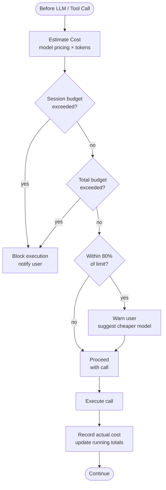
```mermaid
flowchart TD
    CALL([Before LLM / Tool Call]) --> ESTIMATE["Estimate Cost<br/>model pricing × tokens"]
    ESTIMATE --> CHECK_SESSION{"Session budget<br/>exceeded?"}
    CHECK_SESSION -->|no| CHECK_TOTAL{"Total budget<br/>exceeded?"}
    CHECK_SESSION -->|yes| HARD_BLOCK["Block execution<br/>notify user"]

    CHECK_TOTAL -->|no| CHECK_WARN{"Within 80%<br/>of limit?"}
    CHECK_TOTAL -->|yes| HARD_BLOCK

    CHECK_WARN -->|no| PROCEED["Proceed<br/>with call"]
    CHECK_WARN -->|yes| SOFT_WARN["Warn user<br/>suggest cheaper model"]
    SOFT_WARN --> PROCEED

    PROCEED --> EXECUTE["Execute call"]
    EXECUTE --> RECORD["Record actual cost<br/>update running totals"]
    RECORD --> NEXT([Continue])
```

## 13. Consensus Mode Detail

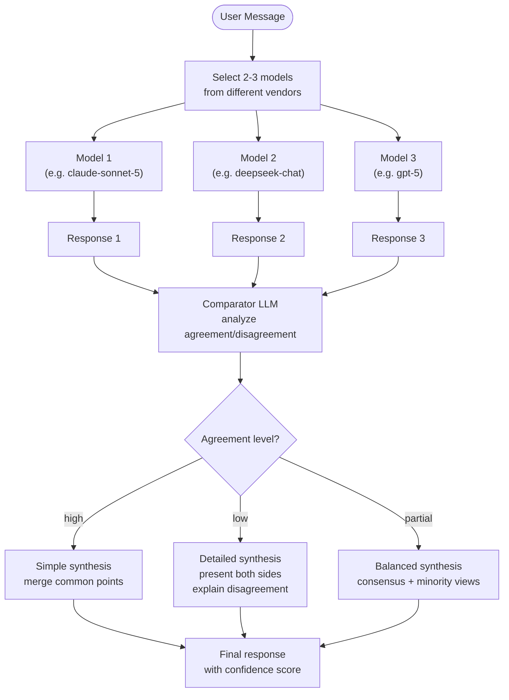
```mermaid
flowchart TD
    MSG([User Message]) --> SELECT["Select 2-3 models<br/>from different vendors"]
    SELECT --> M1["Model 1<br/>(e.g. claude-sonnet-5)"]
    SELECT --> M2["Model 2<br/>(e.g. deepseek-chat)"]
    SELECT --> M3["Model 3<br/>(e.g. gpt-5)"]

    M1 --> R1["Response 1"]
    M2 --> R2["Response 2"]
    M3 --> R3["Response 3"]

    R1 --> COMPARE["Comparator LLM<br/>analyze agreement/disagreement"]
    R2 --> COMPARE
    R3 --> COMPARE

    COMPARE --> AGREEMENT{"Agreement level?"}
    AGREEMENT -->|high| SYNTH_SIMPLE["Simple synthesis<br/>merge common points"]
    AGREEMENT -->|low| SYNTH_DETAIL["Detailed synthesis<br/>present both sides<br/>explain disagreement"]
    AGREEMENT -->|partial| SYNTH_BALANCE["Balanced synthesis<br/>consensus + minority views"]

    SYNTH_SIMPLE --> RESULT["Final response<br/>with confidence score"]
    SYNTH_DETAIL --> RESULT
    SYNTH_BALANCE --> RESULT
```

## 14. Autonomous Mode Detail

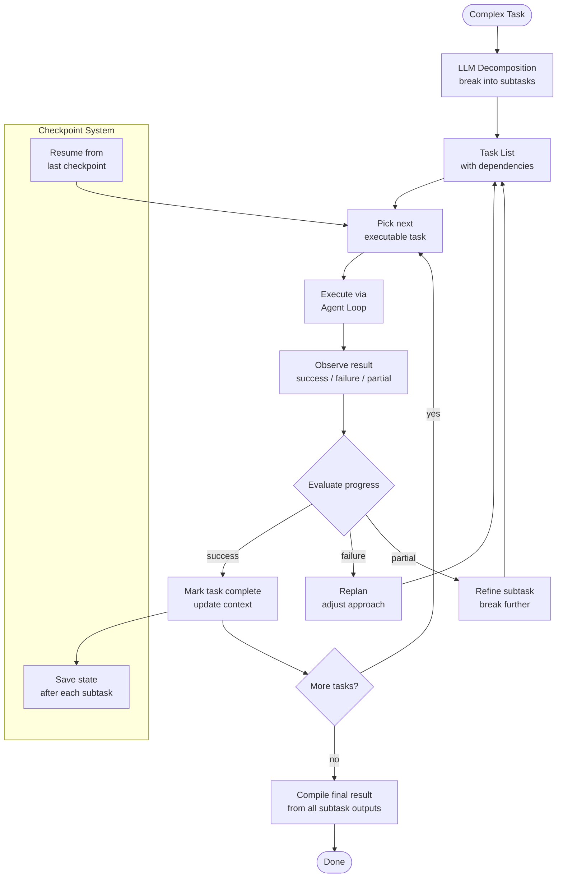
```mermaid
flowchart TD
    TASK([Complex Task]) --> DECOMPOSE["LLM Decomposition<br/>break into subtasks"]
    DECOMPOSE --> TASKS["Task List<br/>with dependencies"]

    TASKS --> PICK["Pick next<br/>executable task"]
    PICK --> EXEC["Execute via<br/>Agent Loop"]
    EXEC --> OBSERVE["Observe result<br/>success / failure / partial"]

    OBSERVE --> EVAL{"Evaluate progress"}
    EVAL -->|success| COMPLETE["Mark task complete<br/>update context"]
    EVAL -->|failure| REPLAN["Replan<br/>adjust approach"]
    EVAL -->|partial| REFINE["Refine subtask<br/>break further"]

    COMPLETE --> REMAINING{"More tasks?"}
    REMAINING -->|yes| PICK
    REMAINING -->|no| FINAL["Compile final result<br/>from all subtask outputs"]
    REPLAN --> TASKS
    REFINE --> TASKS

    FINAL --> DONE([Done])

    subgraph CHECKPOINT["Checkpoint System"]
        CP_SAVE["Save state<br/>after each subtask"]
        CP_LOAD["Resume from<br/>last checkpoint"]
    end

    COMPLETE --> CP_SAVE
    CP_LOAD --> PICK
```

## 15. Phase 4 — Response Cache Flow

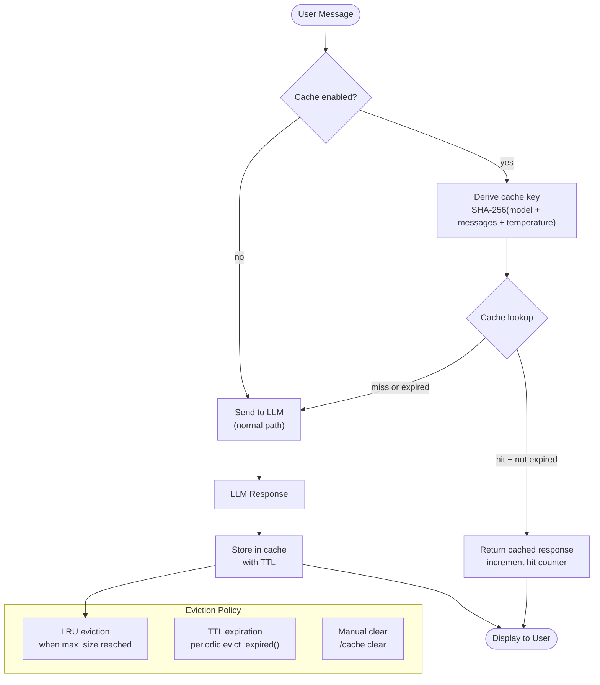
```mermaid
flowchart TD
    MSG([User Message]) --> CACHE_CHECK{"Cache enabled?"}
    CACHE_CHECK -->|no| LLM["Send to LLM<br/>(normal path)"]
    CACHE_CHECK -->|yes| KEY["Derive cache key<br/>SHA-256(model + messages + temperature)"]
    KEY --> LOOKUP{"Cache lookup"}
    LOOKUP -->|hit + not expired| HIT["Return cached response<br/>increment hit counter"]
    LOOKUP -->|miss or expired| LLM
    LLM --> RESPONSE["LLM Response"]
    RESPONSE --> STORE["Store in cache<br/>with TTL"]
    STORE --> OUTPUT([Display to User])
    HIT --> OUTPUT

    subgraph EVICTION["Eviction Policy"]
        LRU["LRU eviction<br/>when max_size reached"]
        TTL_EXP["TTL expiration<br/>periodic evict_expired()"]
        MANUAL["Manual clear<br/>/cache clear"]
    end

    STORE --> LRU
```

## 16. Phase 4 — Auto-Pager Flow

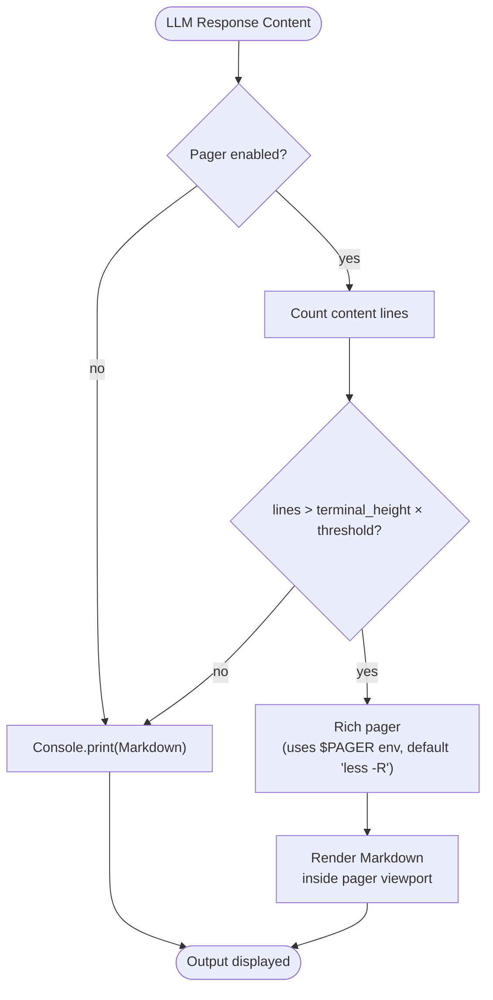
```mermaid
flowchart TD
    CONTENT([LLM Response Content]) --> PAGER_ON{"Pager enabled?"}
    PAGER_ON -->|no| DIRECT_PRINT["Console.print(Markdown)"]
    PAGER_ON -->|yes| MEASURE["Count content lines"]
    MEASURE --> COMPARE{"lines > terminal_height × threshold?"}
    COMPARE -->|no| DIRECT_PRINT
    COMPARE -->|yes| PAGER["Rich pager<br/>(uses $PAGER env, default 'less -R')"]
    PAGER --> RENDER["Render Markdown<br/>inside pager viewport"]
    DIRECT_PRINT --> DONE([Output displayed])
    RENDER --> DONE
```

## 17. Phase 4 — Theme Application Flow

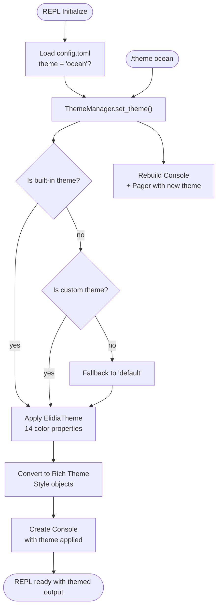
```mermaid
flowchart TD
    INIT([REPL Initialize]) --> LOAD_CONFIG["Load config.toml<br/>theme = 'ocean'?"]
    LOAD_CONFIG --> SET_THEME["ThemeManager.set_theme()"]
    SET_THEME --> BUILTIN{"Is built-in theme?"}
    BUILTIN -->|yes| APPLY["Apply ElidiaTheme<br/>14 color properties"]
    BUILTIN -->|no| CUSTOM_CHECK{"Is custom theme?"}
    CUSTOM_CHECK -->|yes| APPLY
    CUSTOM_CHECK -->|no| FALLBACK["Fallback to 'default'"]
    FALLBACK --> APPLY
    APPLY --> RICH_THEME["Convert to Rich Theme<br/>Style objects"]
    RICH_THEME --> CONSOLE["Create Console<br/>with theme applied"]
    CONSOLE --> REPL_READY([REPL ready with themed output])

    USER_CMD([/theme ocean]) --> SET_THEME
    SET_THEME --> UPDATE_CONSOLE["Rebuild Console<br/>+ Pager with new theme"]
```

## 18. Phase 4 — Full REPL Integration (Complete Data Flow)

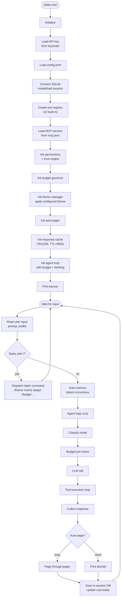
```mermaid
flowchart TD
    START([elidia chat]) --> INIT["Initialize"]
    INIT --> AUTH["Load API key<br/>from keychain"]
    AUTH --> CONFIG["Load config.toml"]
    CONFIG --> DB_CONNECT["Connect SQLite<br/>create/load session"]
    DB_CONNECT --> TOOLS["Create tool registry<br/>(14 built-in)"]
    TOOLS --> MCP_LOAD["Load MCP servers<br/>from mcp.json"]
    MCP_LOAD --> PERMS_INIT["Init permissions<br/>+ trust engine"]
    PERMS_INIT --> BUDGET_INIT["Init budget governor"]
    BUDGET_INIT --> THEME_INIT["Init theme manager<br/>apply configured theme"]
    THEME_INIT --> PAGER_INIT["Init auto-pager"]
    PAGER_INIT --> CACHE_INIT["Init response cache<br/>LRU(256, TTL=600s)"]
    CACHE_INIT --> AGENT_INIT["Init agent loop<br/>with budget + thinking"]
    AGENT_INIT --> BANNER["Print banner"]
    BANNER --> PROMPT([Wait for input])

    PROMPT --> INPUT["Read user input<br/>prompt_toolkit"]
    INPUT --> SLASH{"Starts with /?"}
    SLASH -->|yes| CMD_DISPATCH["Dispatch slash command<br/>/theme /cache /pager /budget ..."]
    CMD_DISPATCH --> PROMPT
    SLASH -->|no| AUTO_MEM["Auto-memory<br/>detect corrections"]
    AUTO_MEM --> AGENT_RUN["Agent loop run()"]
    AGENT_RUN --> MODE_CLASS["Classify mode"]
    MODE_CLASS --> BUDGET_PRE["Budget pre-check"]
    BUDGET_PRE --> LLM["LLM call"]
    LLM --> TOOL_LOOP["Tool execution loop"]
    TOOL_LOOP --> RESPONSE["Collect response"]
    RESPONSE --> PAGE_CHECK{"Auto-page?"}
    PAGE_CHECK -->|long| PAGER_OUT["Page through pager"]
    PAGE_CHECK -->|short| DIRECT_OUT["Print directly"]
    PAGER_OUT --> PERSIST["Save to session DB<br/>update cost totals"]
    DIRECT_OUT --> PERSIST
    PERSIST --> PROMPT
```

## 19. Phase 4 — CI/CD & Distribution Pipeline

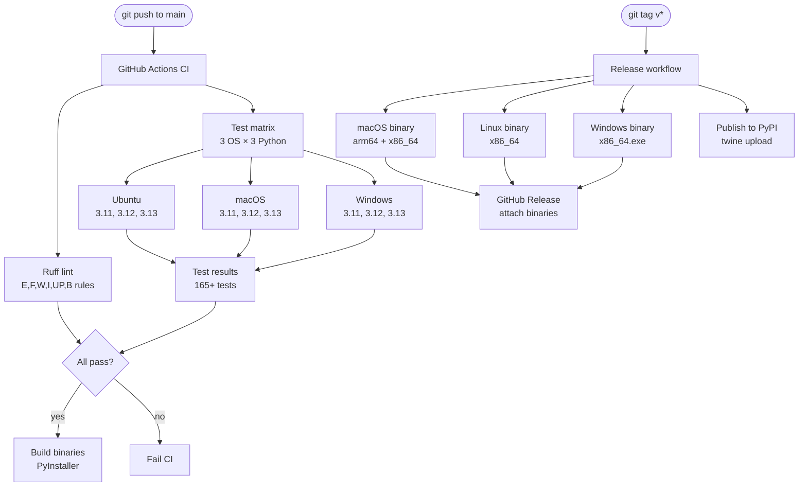
```mermaid
flowchart TD
    PUSH([git push to main]) --> CI["GitHub Actions CI"]
    CI --> LINT["Ruff lint<br/>E,F,W,I,UP,B rules"]
    CI --> TEST_MATRIX["Test matrix<br/>3 OS × 3 Python"]

    TEST_MATRIX --> UBUNTU["Ubuntu<br/>3.11, 3.12, 3.13"]
    TEST_MATRIX --> MACOS["macOS<br/>3.11, 3.12, 3.13"]
    TEST_MATRIX --> WINDOWS["Windows<br/>3.11, 3.12, 3.13"]

    UBUNTU --> RESULTS["Test results<br/>165+ tests"]
    MACOS --> RESULTS
    WINDOWS --> RESULTS

    LINT --> GATE{"All pass?"}
    RESULTS --> GATE
    GATE -->|yes| BUILD["Build binaries<br/>PyInstaller"]
    GATE -->|no| FAIL["Fail CI"]

    TAG([git tag v*]) --> RELEASE["Release workflow"]
    RELEASE --> BIN_MAC["macOS binary<br/>arm64 + x86_64"]
    RELEASE --> BIN_LINUX["Linux binary<br/>x86_64"]
    RELEASE --> BIN_WIN["Windows binary<br/>x86_64.exe"]
    RELEASE --> PYPI["Publish to PyPI<br/>twine upload"]

    BIN_MAC --> GH_RELEASE["GitHub Release<br/>attach binaries"]
    BIN_LINUX --> GH_RELEASE
    BIN_WIN --> GH_RELEASE
```

## 20. Complete Module Dependency Graph

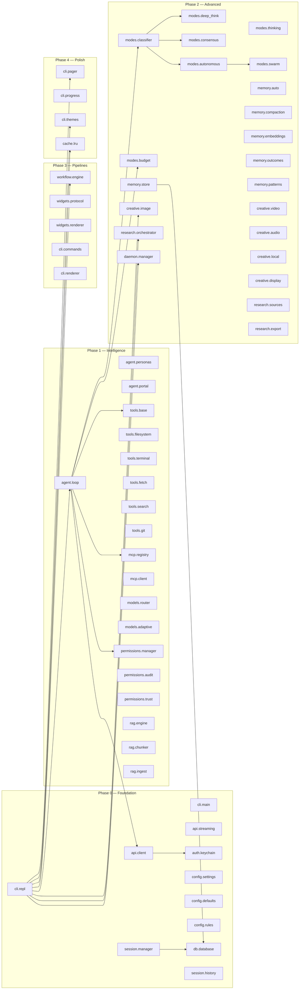
```mermaid
graph LR
    subgraph P0["Phase 0 — Foundation"]
        CLI_MAIN[cli.main]
        CLI_REPL[cli.repl]
        API_CLIENT[api.client]
        API_STREAM[api.streaming]
        AUTH_KEY[auth.keychain]
        CONFIG_SET[config.settings]
        CONFIG_DEF[config.defaults]
        CONFIG_RULES[config.rules]
        DB_DB[db.database]
        SESS_MGR[session.manager]
        SESS_HIST[session.history]
    end

    subgraph P1["Phase 1 — Intelligence"]
        AGENT_LOOP[agent.loop]
        AGENT_PERS[agent.personas]
        AGENT_PORT[agent.portal]
        TOOL_BASE[tools.base]
        TOOL_FS[tools.filesystem]
        TOOL_TERM[tools.terminal]
        TOOL_FETCH[tools.fetch]
        TOOL_SEARCH[tools.search]
        TOOL_GIT[tools.git]
        MCP_REG[mcp.registry]
        MCP_CLI[mcp.client]
        MODEL_ROUTER[models.router]
        MODEL_ADAPT[models.adaptive]
        PERM_MGR[permissions.manager]
        PERM_AUDIT[permissions.audit]
        PERM_TRUST[permissions.trust]
        RAG_ENG[rag.engine]
        RAG_CHUNK[rag.chunker]
        RAG_INGEST[rag.ingest]
    end

    subgraph P2["Phase 2 — Advanced"]
        MODE_CLASS[modes.classifier]
        MODE_THINK[modes.thinking]
        MODE_BUD[modes.budget]
        MODE_DEEP[modes.deep_think]
        MODE_CONS[modes.consensus]
        MODE_AUTO[modes.autonomous]
        MODE_SWARM[modes.swarm]
        MEM_STORE[memory.store]
        MEM_AUTO[memory.auto]
        MEM_COMP[memory.compaction]
        MEM_EMB[memory.embeddings]
        MEM_OUT[memory.outcomes]
        MEM_PAT[memory.patterns]
        CREAT_IMG[creative.image]
        CREAT_VID[creative.video]
        CREAT_AUD[creative.audio]
        CREAT_LOC[creative.local]
        CREAT_DISP[creative.display]
        RES_ORCH[research.orchestrator]
        RES_SRC[research.sources]
        RES_EXP[research.export]
        DAEMON_MGR[daemon.manager]
    end

    subgraph P3["Phase 3 — Pipelines"]
        WF_ENG[workflow.engine]
        WDG_PROTO[widgets.protocol]
        WDG_REND[widgets.renderer]
        CLI_CMD[cli.commands]
        CLI_REND[cli.renderer]
    end

    subgraph P4["Phase 4 — Polish"]
        CLI_PAGER[cli.pager]
        CLI_PROG[cli.progress]
        CLI_THEME[cli.themes]
        CACHE_LRU[cache.lru]
    end

    CLI_REPL --> AGENT_LOOP
    CLI_REPL --> CLI_PAGER
    CLI_REPL --> CLI_THEME
    CLI_REPL --> CACHE_LRU
    AGENT_LOOP --> MODE_CLASS
    AGENT_LOOP --> MODE_BUD
    AGENT_LOOP --> API_CLIENT
    AGENT_LOOP --> TOOL_BASE
    AGENT_LOOP --> MCP_REG
    AGENT_LOOP --> PERM_MGR
    MODE_CLASS --> MODE_DEEP
    MODE_CLASS --> MODE_CONS
    MODE_CLASS --> MODE_AUTO
    MODE_AUTO --> MODE_SWARM
    CLI_REPL --> RES_ORCH
    CLI_REPL --> CREAT_IMG
    CLI_REPL --> WF_ENG
    CLI_REPL --> DAEMON_MGR
    SESS_MGR --> DB_DB
    MEM_STORE --> DB_DB
    API_CLIENT --> AUTH_KEY
```

## 21. Skill Categories — Coverage Status (2026-07-26 audit → shipped same day)

Audited against 11 requested skill categories on 2026-07-26. Started at 5
existing + 6 gaps; by end of day all 5 buildable gaps (Browser, Office,
Database, Email, Calendar) were designed, implemented, tested, and shipped
— tracked as AIUT-2134 through AIUT-2138. Only API (partial, not
scheduled) and Desktop (moot — no host app exists) remain open.

```mermaid
flowchart TD
    subgraph DONE["Shipped 2026-07-26"]
        FS["Filesystem Skills<br/>tools/filesystem.py"]
        TERM["Terminal Skills<br/>tools/terminal.py"]
        CODE["Code Skills<br/>tools/git.py + code mode routing"]
        VIS["Vision Skills<br/>image upload + multimodal chat"]
        BROWSER["Browser Skills — AIUT-2134<br/>tools/browser.py — Playwright, session-scoped Chromium"]
        OFFICE["Office Skills — AIUT-2135<br/>tools/office.py — read reuses rag/ingest.py parsers, write is new"]
        DB["Database Skills — AIUT-2136<br/>tools/database.py — read-only v1, sqlparse-validated SELECT-only"]
        EMAIL["Email Skills — AIUT-2137<br/>tools/email.py — SMTP/IMAP, app-password v1"]
        CAL["Calendar Skills — AIUT-2138<br/>tools/calendar.py — local .ics v1"]
    end

    subgraph OPEN["Still open"]
        API_P["API Skills — partial, not scheduled<br/>tools/fetch.py (raw HTTP) + MCP client (generic extensibility)"]
        DESK["Desktop Skills — moot<br/>no Desktop app exists yet (Phase 4, unstarted)"]
    end

    TR[ToolRegistry] --> FS
    TR --> TERM
    TR --> CODE
    TR --> VIS
    TR --> BROWSER
    TR --> OFFICE
    TR --> DB
    TR --> EMAIL
    TR --> CAL
    TR --> API_P
    TR -.->|not registered, no host app| DESK

    style OPEN fill:none,stroke:#a5432c,stroke-dasharray: 4 3
    style DONE fill:none,stroke:#1f7a4c
```

**How the 3 highest-risk categories (Email, Calendar, Database) actually
shipped:** Database is read-only in v1 — write/DDL is a separate, later
capability. Email and Calendar shipped as app-password SMTP/IMAP and
local `.ics` respectively rather than OAuth2/cloud APIs, since OAuth2
needs a provider app registration (redirect URIs, consent screen) that's
infra/account setup outside what a code change alone delivers and can't
be honestly live-verified without it already existing — both are real,
immediately usable v1s whose underlying logic carries over unchanged
once OAuth is layered on top later.

**Permission framework hardening that came out of this:** wiring
Database's `EVERY_TIME` tier surfaced that `TrustEngine`'s progressive
trust could still auto-promote an `EVERY_TIME` action to no-prompt after
enough clean approvals — fine for repeated file deletes in a familiar
project, wrong for an action where one unnoticed approval hands the
agent a standing capability with real external consequences. Added
`NEVER_PROMOTE` (`permissions/manager.py`) — `db_query` and `email_send`
are now permanently exempt from promotion, proven with a regression test
showing 25 consecutive approvals still prompt on the 26th call. See the
master plan (`06_CLI_AND_DESKTOP_MASTER_PLAN.md`, §4.4) for full detail
and commit references.

## 22. RAG Subsystem — Reconnected (2026-07-27, AIUT-2141)

`RagEngine`/`FileIngestPipeline` existed (~1,135 LOC) but were never
called from any user-facing surface — confirmed via `grep -rn
"FileIngestPipeline(\|RagEngine(" elidia/` returning zero hits outside
`elidia/rag/` itself. Wired up per the requested design (all three, not
one-or-the-other): `elidia rag ingest/search/list/clear` (CLI), `/rag
...` (REPL), and auto-ingest for files over ~8,000 chars passed via
`-f/--file` (preview + index instead of blind truncation, including the
>1MB case that previously just dropped the file). The read side is a new
`rag_search` tool (AUTO tier, agent-invocable) — ingestion stays a
deliberate user action across all three entry points, never
agent-triggered, so an embedding-cost operation can't fire mid-conversation
without the user asking for it.

Live end-to-end verification surfaced and fixed three further real bugs
along the way, not just wiring:

1. **FTS5 query builder crashed on hyphenated terms** — `_build_fts_query`
   escaped special characters individually but not `-`, and FTS5's query
   grammar treats an in-word hyphen as syntax (`on-call*` → `no such
   column: call`), not just a tokenizer boundary. Fixed by quoting every
   term (`"on-call"*`) instead of trying to enumerate escapable characters.
2. **Chunker never split an oversized paragraph/section/line** — a 21KB
   file with no blank lines produced *one* chunk containing the entire
   file instead of ~40, diluting the embedding enough that a fact in the
   middle became unfindable by search. Fixed for all three content types
   (`text`, `markdown`, `code`) via a shared `_split_oversized` helper.
3. **`elidia ask` silently dropped `-f/--file`** — the subcommand never
   declared its own `--file` option and never read the parent group's
   either, so both `elidia ask -f x.txt "..."` and `elidia --file x.txt
   ask "..."` reached the model with nothing attached. Fixed by mirroring
   how `-i/--image` already worked (own option + parent fallback).

34 new tests added across `test_rag_tool.py` and `test_chunker.py`
(chunker fix verified with a real FTS5 in-memory table, not just string
inspection). Full live proof, not just unit tests: real `elidia rag
ingest` → real `elidia ask` with the agent autonomously calling
`rag_search` → correct grounded answer citing the ingested content.
