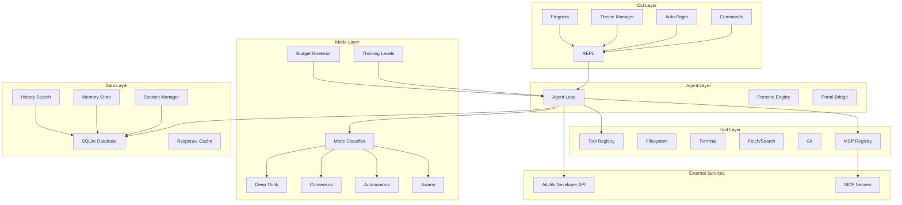
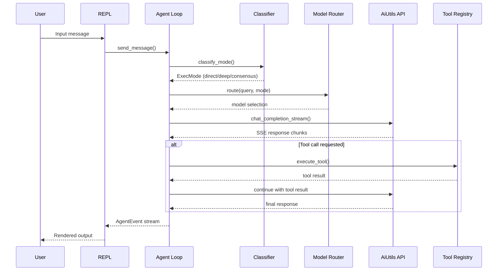
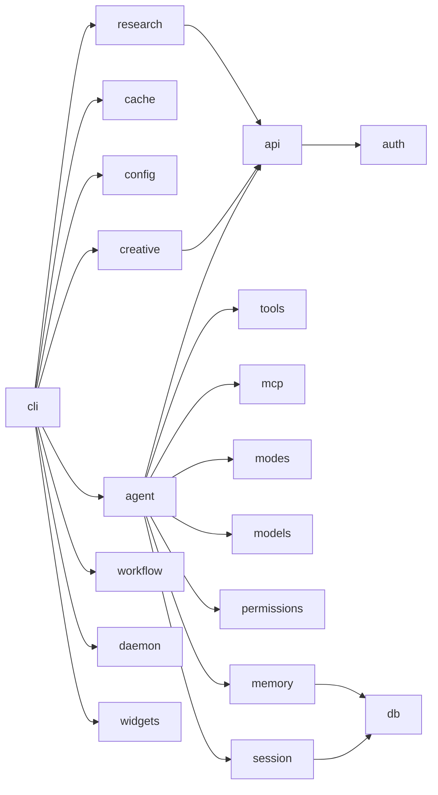

# Architecture Overview

Elidia CLI is a standalone terminal AI agent built in Python. It connects to the AiUtils Developer API for model inference and tool execution, with no dependency on the AiUtils portal backend.

## Design Principles

1. **Standalone** — self-contained; copies what it needs, never imports from the portal
2. **Multi-model** — routes to the best model per task, not locked to one provider
3. **Tool-augmented** — agent loop with permission-gated tool execution
4. **Extensible** — MCP servers add tools without code changes
5. **Observable** — structured logging, audit trail, budget tracking

## System Architecture

## Request Flow

## Package Dependencies

## Data Flow

All data flows through three channels:

1. **User ↔ REPL** — prompt_toolkit input, Rich output (with pager/themes)
2. **Agent ↔ API** — httpx async HTTP/2 with SSE streaming
3. **Agent ↔ Tools** — local tool execution or MCP server RPC

State is persisted to:

- `~/.elidia/elidia.db` — sessions, messages, memory entries
- `~/.elidia/config.toml` — user configuration
- `~/.elidia/keychain.json` — API key storage
- `~/.elidia/audit.jsonl` — permission audit log
- `~/.elidia/media/` — generated images, videos, audio
- `~/.elidia/research/` — exported research reports
