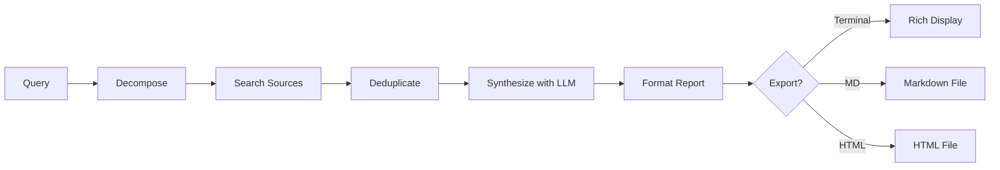

# Research

## Overview

The `/research` command runs a multi-source search, synthesizes findings, and produces a cited report.

## Usage

```
> /research "Impact of transformer architectures on NLP"
> /research "Python async best practices" --export md
> /research "Climate change policy in EU 2024" --export html
```

## How It Works

1. **Query decomposition** — breaks complex queries into sub-queries
2. **Parallel search** — searches across configured MCP sources
3. **Deduplication** — removes duplicate results
4. **Synthesis** — LLM synthesizes findings into a coherent report
5. **Citation** — sources are cited inline and listed at the end

## Export Formats

| Format | Command | Output |
|--------|---------|--------|
| Terminal | `/research <query>` | Rich Markdown in terminal |
| Markdown | `/research <query> --export md` | `~/.elidia/research/report_*.md` |
| HTML | `/research <query> --export html` | `~/.elidia/research/report_*.html` |

## Research Sources

Sources are configured through MCP search servers. Available source types:

- **Web search** — general web results
- **Academic** — academic paper databases
- **News** — recent news articles
- **Code** — code repositories and documentation

## Research Flow


