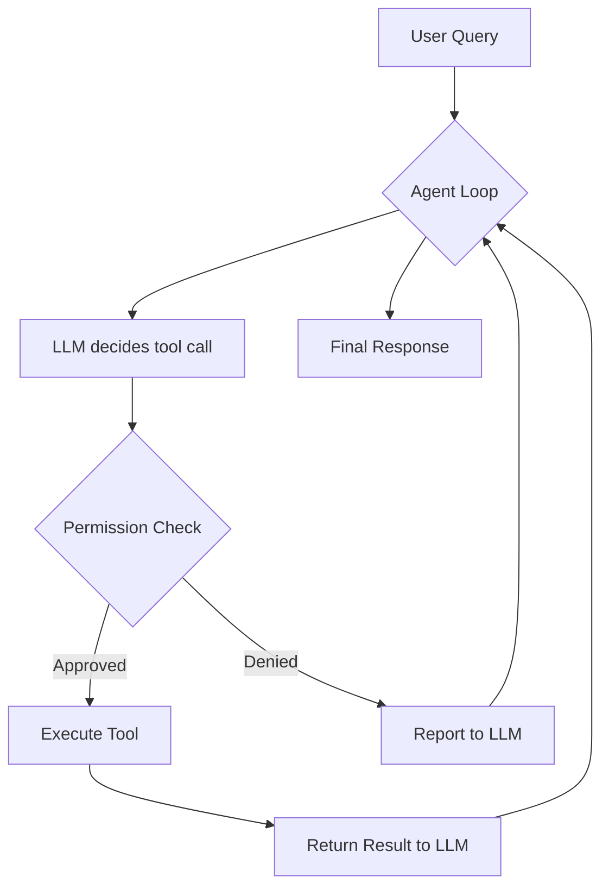

# Tools & MCP

## Built-in Tools

Elidia ships with tools in several categories:

| Category | Tools | Description |
|----------|-------|-------------|
| `filesystem` | read, write, list, search | File operations |
| `shell` | execute, background | Shell command execution |
| `web` | fetch, search | Web requests and search |
| `code` | analyze, lint, format | Code analysis |

View all tools:

```
> /tools
> /tools filesystem      # Filter by category
```

## Permissions

Tools require user approval based on risk level:

- **Read** — auto-approved by default
- **Write** — requires approval
- **Shell** — requires approval
- **Web** — configurable

The trust engine learns from your decisions:

```
> /trust                 # Show trust stats
```

After consistently approving an action, Elidia auto-promotes it (no more prompts).

## MCP Integration

Elidia supports [Model Context Protocol](https://modelcontextprotocol.io/) servers for extending tool capabilities.

### Configuration

Add MCP servers to `~/.elidia/mcp.json`:

```json
{
  "servers": {
    "filesystem": {
      "command": "npx",
      "args": ["-y", "@modelcontextprotocol/server-filesystem", "/home/user"]
    },
    "github": {
      "command": "npx",
      "args": ["-y", "@modelcontextprotocol/server-github"],
      "env": {
        "GITHUB_TOKEN": "ghp_..."
      }
    }
  }
}
```

### Managing MCP Servers

```
> /mcp                          # List connected servers
> /mcp disconnect github        # Disconnect a server
```

MCP tools appear alongside built-in tools and are invoked with the same permission system.

## Tool Execution Flow


