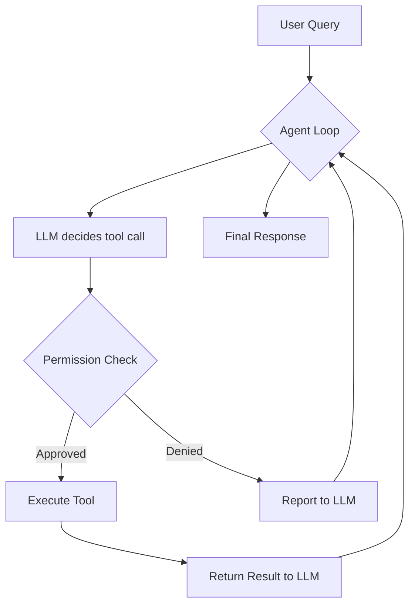

# Tools & MCP

## Built-in Tools

Elidia ships with tools in several categories:

| Category | Tools | Description |
|----------|-------|-------------|
| `filesystem` | read, write, edit, list, glob, grep | File operations |
| `terminal` | command_exec | Shell command execution |
| `git` | status, diff, log, commit, branch | Git workflow |
| `search` / `fetch` | web_search, http_fetch | Web requests and search |
| `browser` | navigate, click, type, screenshot, extract_links | Headless browser automation (Playwright) |
| `office` | read/write docx, read/write xlsx, read pptx | Office document parsing |
| `database` | connect, query, list_tables, describe_table | Read-only SQL |
| `email` | send, search, read | SMTP send / IMAP search+read |
| `calendar` | list_events, add_event, find_conflicts | Local .ics calendar |
| `rag` | rag_search, rag_list_sources | Search content ingested into the local RAG store |

View all tools:

```
> /tools
> /tools filesystem      # Filter by category
```

## RAG (Retrieval-Augmented Search)

Large files don't need to fit in the conversation — Elidia can index them
into a local RAG store (sqlite-vec, hybrid BM25 + semantic search) and
retrieve relevant chunks on demand via the `rag_search` tool. Three ways
to get content in:

```
elidia rag ingest <path>        # explicit, works on a file or a directory
> /rag ingest <path>            # same, from inside the REPL
> /rag search <query>           # search without waiting for the agent to do it
elidia ask -f big_file.md "..." # auto-ingest: files over ~8,000 chars are
                                 # previewed + indexed instead of truncated
```

`elidia rag list` / `/rag list` shows how much is currently ingested;
`elidia rag clear` / `/rag clear` empties the store. Ingestion is always
a deliberate, user-triggered action (CLI command, slash command, or the
`-f` auto-ingest path) — the agent can search what's already ingested via
`rag_search`, but never triggers ingestion on its own mid-conversation.

## Permissions

Tools require user approval based on risk level:

- **Read** — auto-approved by default
- **Write** — requires approval
- **Shell** — requires approval
- **Web** — configurable

The trust engine learns from your decisions:

```
> /trust                 # Show trust stats
```

After consistently approving an action, Elidia auto-promotes it (no more prompts).

## MCP Integration

Elidia supports [Model Context Protocol](https://modelcontextprotocol.io/) servers for extending tool capabilities.

### Configuration

Add MCP servers to `~/.elidia/mcp.json`:

```json
{
  "servers": {
    "filesystem": {
      "command": "npx",
      "args": ["-y", "@modelcontextprotocol/server-filesystem", "/home/user"]
    },
    "github": {
      "command": "npx",
      "args": ["-y", "@modelcontextprotocol/server-github"],
      "env": {
        "GITHUB_TOKEN": "ghp_..."
      }
    }
  }
}
```

### Managing MCP Servers

```
> /mcp                          # List connected servers
> /mcp disconnect github        # Disconnect a server
```

MCP tools appear alongside built-in tools and are invoked with the same permission system.

## Tool Execution Flow


